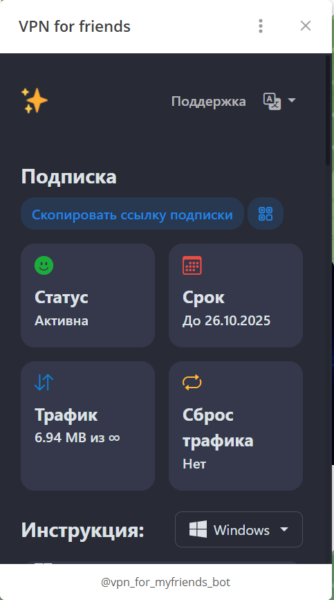

🌐 Доступные языки: [Русский](README.md) | [English](README.en.md)

# 🌐 Marzban Custom Subscription Page  
**Готовый HTML-шаблон страницы подписки для панели Marzban (замена `/subscription/<username>`).**

Страница полностью автономная — все стили, скрипты, иконки, словари и логика находятся внутри одного файла  
`template_subscription_index.html`.

Шаблон использует механизм Marzban и автоматически получает данные о пользователе (uuid, срок, лимиты, inbounds, подписочный URL) через Jinja.

---

# 🚀 Возможности

- 🔄 Полная замена стандартной страницы Marzban  
- 🔗 Автоматическая подстановка `subscription_url`, `user`, `inbounds`, `xray_config_base64`  
- 📱 Deeplink-импорт в популярные клиенты (V2RayTun, Sing-box, Hiddify и др.)  
- 🌍 Многоязычие (ru/en), словари встроены в файл  
- 🎨 Красивый современный интерфейс на Bootstrap + встроенный CSS  
- 🧩 Встроенные SVG-иконки приложений  
- 🧪 Вся логика — в одном HTML-файле, без внешних зависимостей  

---

# 📁 Структура проекта

```
marzban-sub-page/
└── template_subscription_index.html   # один файл, включающий CSS+JS+SVG+логика
```

---

# 🔌 Установка и интеграция с Marzban

## 1. Убедитесь, что в `.env` включена поддержка пользовательских шаблонов

В файле `/opt/marzban/.env` должна быть строка:

```
CUSTOM_TEMPLATES_DIRECTORY="/var/lib/marzban/templates/"
```

Marzban автоматически подгружает шаблоны из этой директории.

---

## 2. Создайте структуру каталогов для шаблона

```bash
sudo mkdir -p /var/lib/marzban/templates/subscription/
```

---

## 3. Поместите шаблон страницы подписки в нужный путь

```bash
sudo cp template_subscription_index.html      /var/lib/marzban/templates/subscription/index.html
```

После этого Marzban автоматически начнёт использовать ваш шаблон.

---

## 4. Перезапустите Marzban

```bash
docker compose down
docker compose up -d
```

---

# 📌 Адрес, по которому доступна страница

Пользователь получает подписочную страницу по ссылке вида:

```
https://<domain>/sub/<base64-token>
```

Например:

```
https://marzban-s2.vpn-for-friends.com:4443/sub/dXNfMjI5LDE3NjM2...
```

Это корректный и единственный пользовательский URL.

---

# 🔄 Альтернативная (устаревшая) установка через volume

Если хотите заменить шаблон напрямую внутри контейнера (не рекомендуется):

```yaml
services:
  marzban:
    volumes:
      - /opt/marzban/template_subscription_index.html:/code/app/templates/subscription/index.html
```

Но при использовании `CUSTOM_TEMPLATES_DIRECTORY` **этот метод не нужен**.

---

# 🧬 Поддерживаемые переменные (Jinja)

| Переменная | Описание |
|-----------|----------|
| `subscription_url` | URL подписки (`/sub/<uuid>`) |
| `panel_url` | URL панели |
| `user` | Объект пользователя |
| `user.uuid` | UUID |
| `user.username` | Логин |
| `user.expire_date` | Дата окончания |
| `user.data_limit` | Лимит трафика |
| `user.data_limit_reset_strategy` | Стратегия сброса |
| `user.sub_status` | Статус |
| `user.on_hold_expire_duration` | Заморозка |
| `inbounds` | Список инбаундов |
| `xray_config_base64` | Base64-конфигурация |

---

# 🧩 Примеры кода внутри шаблона

### Ссылка подписки
```html
<a href="{{ subscription_url }}" class="btn btn-primary">Download subscription</a>
```

### Вывод UUID
```html
<p>Your UUID: {{ user.uuid }}</p>
```

### Инбаунды
```html

  <li>{{ ib.remark }} — {{ ib.address }}:{{ ib.port }}</li>

```

---

# 🎨 Кастомизация

Все элементы страницы находятся в одном HTML-файле.  
Вы можете изменять:

## 🔸 Переводы (MESSAGES)

Внутри `<script>` расположен объект:

```js
const MESSAGES = { ru: {...}, en: {...} }
```

Можно:

- обновлять тексты  
- добавлять новые языки (`fa`, `zh`, `tr`…)  
- менять язык по умолчанию  

---

## 🔸 Deeplink-ссылки

Функции:

```js
setupLink("href-v2raytun");
setupLink("href-singbox");
```

формируют deeplink URL на основе `{{ subscription_url }}`.

---

## 🔸 Стили

CSS находится в `<style>` в начале файла — вы можете менять:

- цветовую тему  
- фон  
- размеры элементов  
- кнопки и карточки  
- логотип  

---

## 🔸 Иконки

SVG-спрайт встроен внутри HTML-файла.  
Чтобы добавить новый значок — вставьте новый `<symbol>`.

---

## 🖼️ Пример страницы



---

# 🤝 Вклад

PR-ы приветствуются!  
Вы можете:

- улучшить UI  
- добавить новые языки  
- расширить список поддерживаемых клиентов  
- улучшить логику deeplink  

---

## 📄 Лицензия

Проект распространяется под лицензией **MIT**.  
Свободно используйте и модифицируйте под свои нужды.

---

**Автор:** [Sergey Ryabkov](https://github.com/ryabkov82)  
**Проект:** [VPN for Friends](https://t.me/vpn_for_myfriends_bot)
